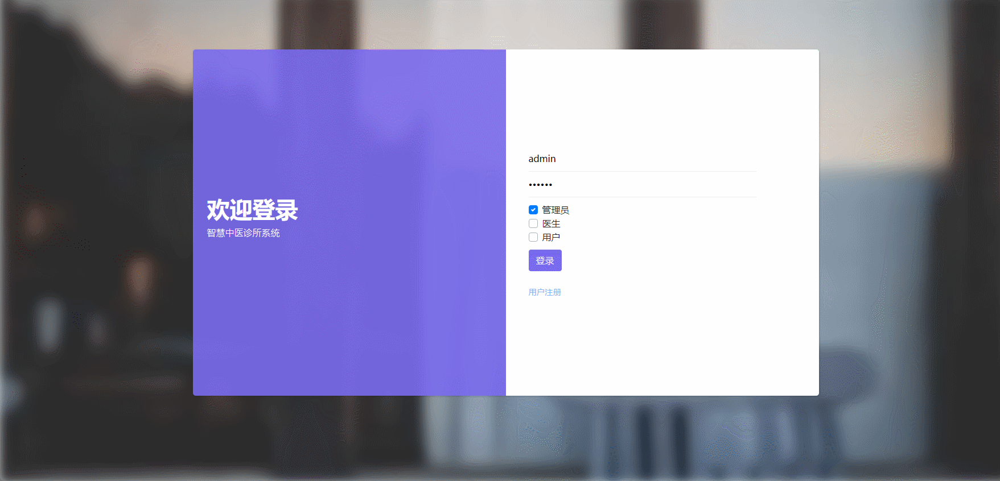
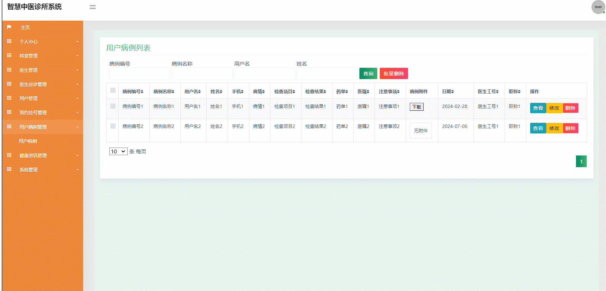

#  chinese_medicine🎂

基于SSM的智能中医诊所管理系统

## 介绍🌞

> 该系统设计管理员的角色，他们能够管理医生、科室、用户以及预约挂号信息，还能下载病例，发布健康资讯，并处理客服聊天记录。医生则可以管理自己的出诊信息，审核预约，以及管理病人的就诊记录。对于用户而言，他们在前端可以浏览 医生的出诊时间，预约医生，对医生进行评价和收藏，阅读健康资讯，联系客服。在后端，用户可以支付挂号费用并下载病例。利用智能中医诊所管理系统，我们可以实现信息的系统化、流程化和规范化，确保操作与实际流程一致。该系统对医院预约挂号信息进行标准化管理，采用电子方式存储，便于管理人员快捷检索和维护，从而有效缩减信息处理时间，降低人力和管理成本，提升工作效率。

## 软件架构

- 管理员的职责涵盖管理医生、科室和用户，同时承担起维护用户预约挂号信息的责任。他们能够下载用户的病历，发布健康资讯，并处理客服的聊天信息
- 医生端的功能设计涵盖了管理个人的诊疗日程、审核及处理预约挂号事务，以及对患者的病历资料进行有效管理
- 用户可在前端界面浏览医生出诊信息，进行预约挂号、评价医生及收藏。同时，他们还能查阅健康资讯和联络客服。在后端，用户将完成挂号费用的支付，并可下载个人病例

## 项目演示🌞

> 管理端






> 医生端


> 患者端


## 安装教程🌞

```
1. 运行环境准备mysql8 + java8

2. 配置maven路径，加载依赖

3. 运行sql文件，确保application.yml或config.properties的数据库名称和账号密码是数据库所在主机的账号密码
```


## 使用说明🌞

```
1. 登入

      	管理员账号：admin 密码：123456 访问链接:http://localhost:8080/yy-ssmj/jsp/login.jsp

        医生账号：doctor 密码：123456 访问链接:http://localhost:8080/yy-ssmj/jsp/login.jsp

        患者账号：patient 密码：123456 访问链接http://localhost:8080/yy-ssmj/front/pages/login/login.jsp
  
2. 运行流程

SpringBoot+Vue项目的部署详情可以查看这篇CSDN博客：http://t.csdnimg.cn/kpuxS

前后端不分离项目的部署流程可以查看这篇CSDN博客：http://t.csdnimg.cn/CslA5
```


## CSDN项目合集🌞

点击前往：http://t.csdnimg.cn/Q4u84


## 联系我🌞

**有偿获取完整源码或调试代码**

🐧：1902317191

微信：


